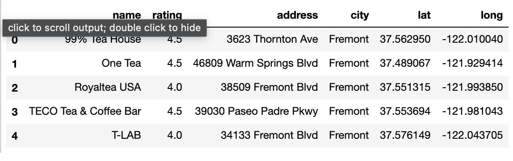
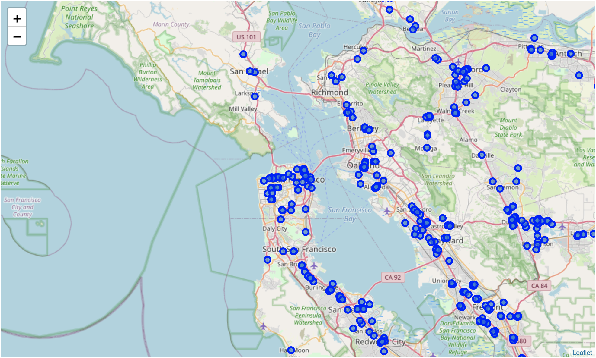
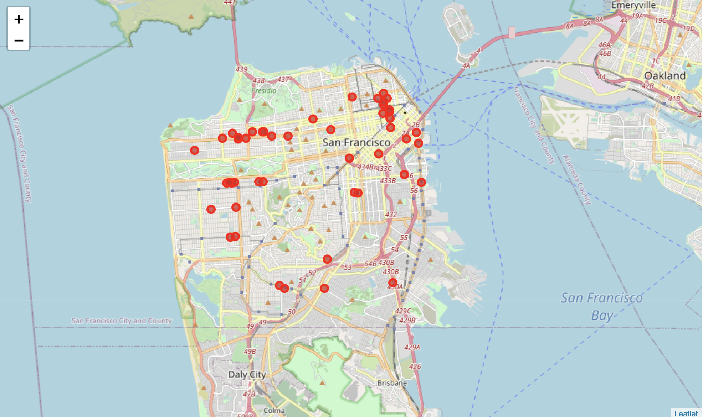
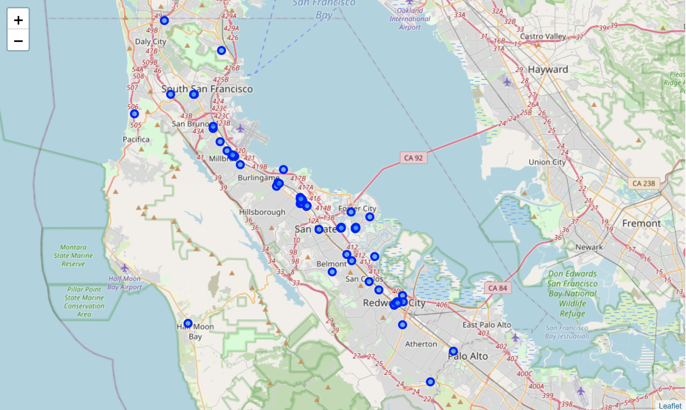
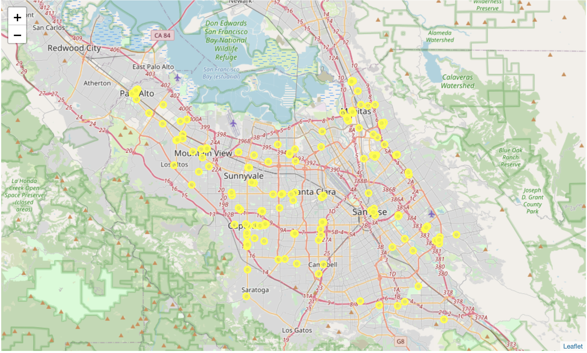
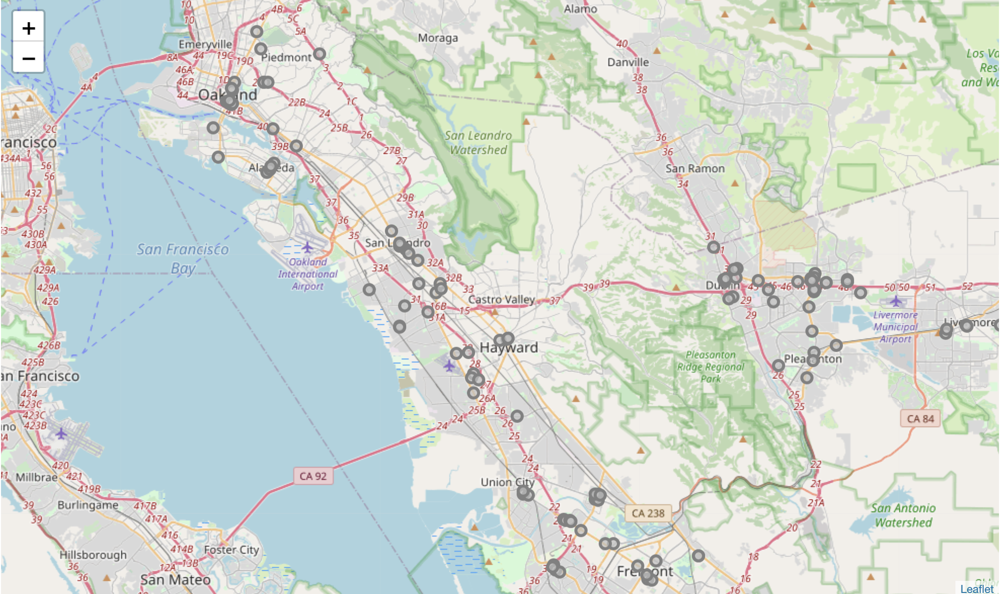
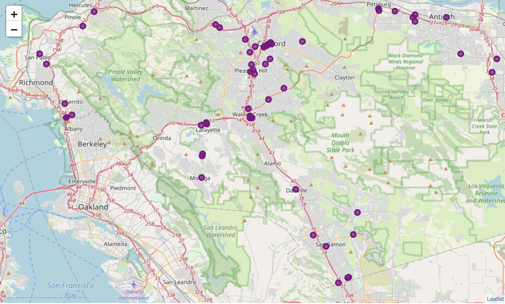
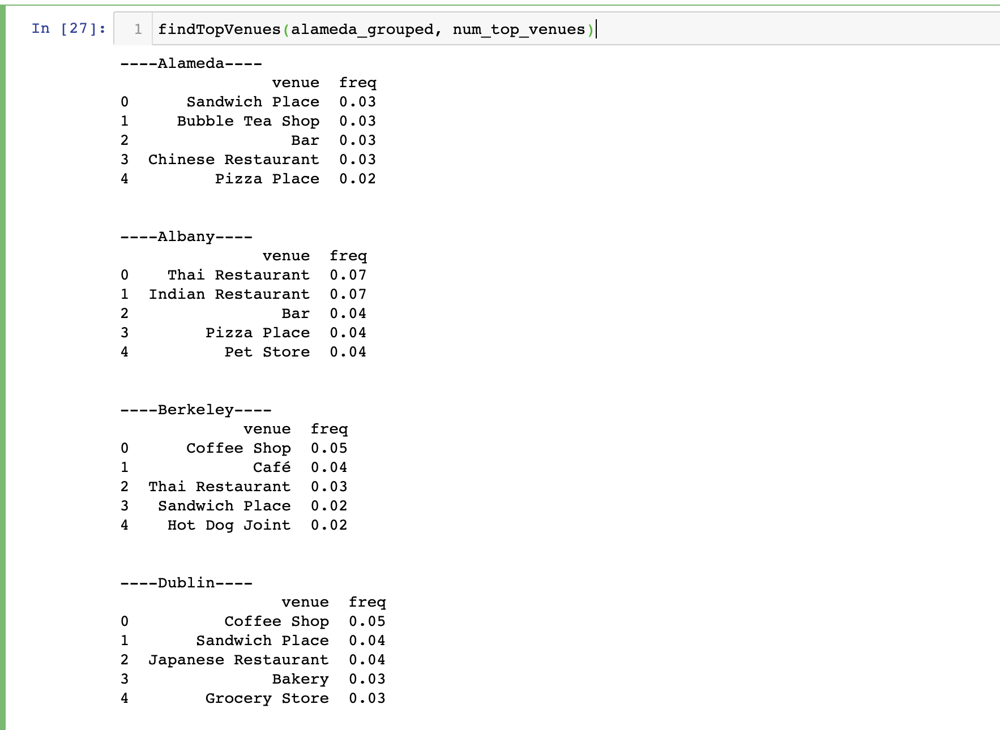
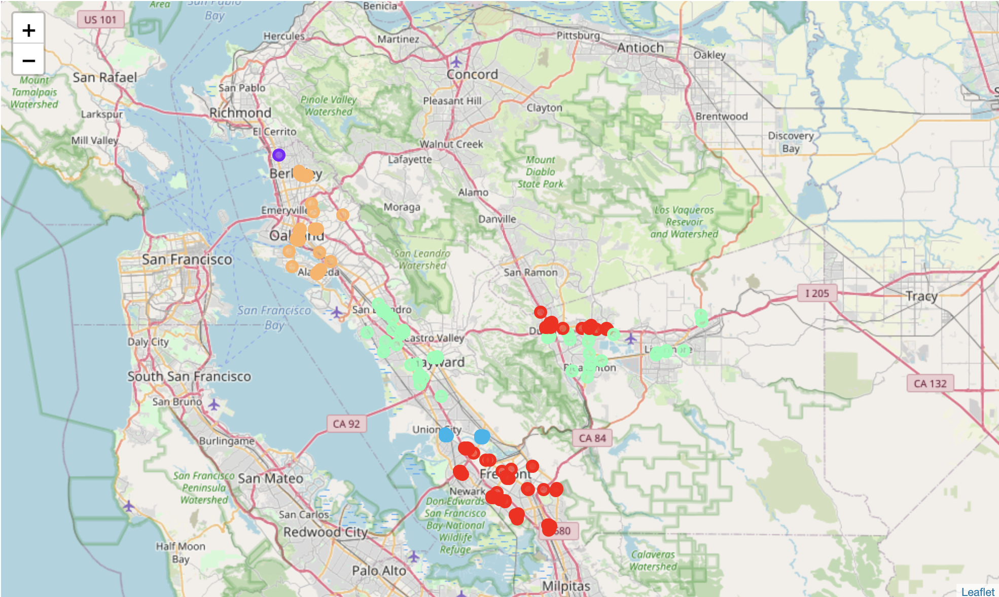
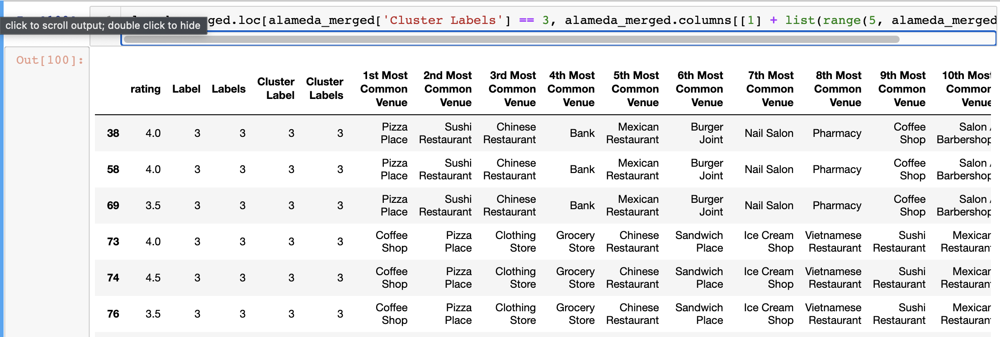

# Capstone Project Report: Boba Bao
**Author:** Austin Tao  
**Date:** January 2nd, 2021

## Table of Contents
* [Introduction/Business Problem](#introduction)
* [Data](#data)
* [Analysis Part 1](#analysis)
* [Analysis Part 2](#analysis2)
* [Conclusion](#conclusion)

## Introduction/Business Problem 
Bubble Tea (also known as "boba", "boba tea", "pearl milk tea") is a popular tea drink with tapioca that has quickly become a major trend in the food and beverage industry. Large portions of the US market are based in metropolitan areas on both the east and west coasts; in the Cupertino Village located directly across from Apple Park, no fewer than 5 bubble tea stores adjorn the plaza! It is clear that this market is competitive, both between different bubble tea stores and with other cafes and beverage chains such as Starbucks and Dunkin'.  
  
This leads to the following business problem: **If you are a businessperson looking to start a new bubble tea store in the Silicon Valley area, where would you plan to locate your store?** 

## Data 
### Data Sets:
The data that will be worked with will be a combination of Foursquare location data and data from the `bayarea_boba_spots.csv` available [here](https://www.kaggle.com/vnxiclaire/bobabayarea). The csv file will primarily be used to compare between two boba shops, while Foursquare location data will be used to assess generalized venues in areas (i.e. businesses outside of the bubble tea sector). **In short, Foursquare will be used to analyze generalized location data while the aforementioned csv file will be used solely to compare bubble tea data.**

### Cleaning Data:
Because the `bayarea_boba_spots.csv ` was taken from a reputable source, there was not much to be done in the ways of cleaning data. There were no missing values, no NaN values, and no outliers. However, the dataframe's 'Unnamed: 0' column had to be dropped because it was a duplicate of an index. After doing this, the shape of the dataframe was (603, 6), meaning there were 603 independent entries for boba stores in the Bay Area. The head of the data frame is shown below:

## Analysis: Part 1 
To begin, analysis started with plotting the different milk tea stores that were present in our data set. This was done using `Nominatim` and `geopy`. The geographical coordinates for the Bay Area were entered and then the respective milk tea stores were marked in blue as shown below:

From there, in order to have more efficient analysis, the data was split by 5 counties in the Bay Area: San Francisco, San Mateo, Santa Clara, Alameda, and Contra Costa Counties. The plotting of each of these locations was done using the `mapCounty` function and the output is shown below:

### San Francisco:

### San Mateo:

### Santa Clara:

### Alameda:

### Contra Costa:

For each of these 5 locations, the Foursquare API was utilized to explore the county and identify information about the types of venues in the county. Specifically, the top 5 categories of venues for each city in every county were identified. This allowed us to see not only how popular boba stores were in a particular city, but also how popular other similar venues are (e.g. cafes, coffee shops, bakeries, etc.). This was done using the `getNearbyVenues` function, the `oneHotEncoding` function, and the `findTopVenues` function. After applying each of these functions to a county, the result would be as follows:

Doing this for each of the 5 counties, we were able to figure out how popular milk tea (and the beverage sector as a whole) are in each of the 5 counties. This was calculated by finding the fraction of cities in each county that had a beverage venue in their top 5 venues over the total number of cities in the county. In other words, 
 
\\[ \text{Percentage} = \frac{\text{beverage venue in top 5 venues}}{\text{total number of cities}}\\]

Using this equation, we ended up with the following percentages:

|   County     | Percentage of cities with high competition |
| :---------   | :----------------------------------------: |
|    S.F.      |        100% (only one city in county)      |
| San Mateo    |          64%                               |
| Santa Clara  |        100% (with 15 cities in county)     |
| Alameda      |          58%                               |
| Contra Costa |            65%                             |

**Based off of these percentages, we are able to narrow our search down to San Mateo, Alameda, and Contra Costa counties;** both San Francisco and Santa Clara county are oversaturated with boba stores/comparable beverage venues, so it would not make sense to open a new store in those counties.

## Analysis: Part 2 
At this point, we are down to three counties to analyze and pick from. To further narrow down our search for the ideal location, we revisit the `bayarea_boba_spots.csv` in order to look at rating information for each of the counties. We found the average ratings as follows:

|   County     |  Rating (max of 5)  |
| :---------   | :------: |
| San Mateo    | 3.86     |
| Alameda      | 3.72     |
| Contra Costa | 3.77     |

We note that Alameda county has the lowest average rating for their milk tea stores. **We will make the assumption that this means the competition in Alameda county is the lowest. This is not a guarantee!** The following analysis can be performed for any of the above counties, so it can be repeated and tried again. For simplicity, we stuck to using Alameda county.

### K-means-clustering:
Now that we selected Alameda county, we performed K-means-clustering on all the boba stores in the county to see the general trend for opening stores in the county. We did so with 5 clusters, which can be seen in the figure below:

This clustering grouped all the similar venue areas together so we can see in which area population is fiercest. An example of the output is shown below:

By performing this K-means-clustering, we were able to conclude that one particular cluster would be the most ideal area for starting a new pearl milk tea store

## Conclusion
The purpose of this project was to take a large data set of the milk tea stores in the Bay Area and determine where the optimal location for a new milk tea store would be if one was a new business owner. Using the Foursquare API, we were able to divide the Bay Area into 5 major counties, then further focus in on individual cities using the `bayarea_boba_spots.csv` to compare rating data. K-means-clustering was used to then cluster these stores by characteristics to see which area would be most competitive, thus allowing us to find the area with least competition.

Our analysis showed that when considering the popularity of pearl milk tea stores and other beverage industry companies that sell similar goods, **the optimal location for opening a new, non-franchised store in the immediate Bay Area is in Union City, Alameda County.** 